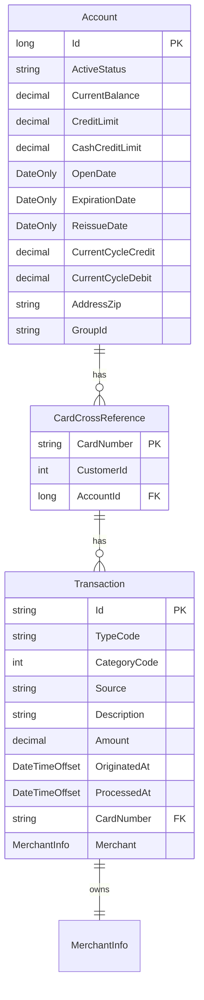

# Online Transaction Management — domain model

**Review the C# in this pull request.** The diagram and notes make that faster.

*Could a C# developer who has never seen the legacy system read and maintain this?*

> `CONFORMANCE.md` — 12 type corrections applied, nothing blocking.

## Model

## Entities

- **`Account`** → `accounts` — A customer credit-card account with balance, credit limits, and cycle-to-date totals
- **`CardCrossReference`** → `card_cross_references` — Links a card number to its owning account and customer, enabling card-to-account lookups
- **`Transaction`** → `transactions` — A single financial transaction (payment, purchase, etc.) posted against a card

## Left out of the model

| Source record | Why |
|---|---|
| `COCOM01Y` | CICS COMMAREA — transient inter-program communication state, not persisted business data |
| `COTTL01Y` | Screen title and thank-you text constants — UI presentation, not persisted business data |
| `CSDAT01Y` | Working-storage date/time scratch area (WS- prefix) — runtime formatting helpers, not persisted business data |
| `CSMSG01Y` | Common screen message text constants — UI presentation, not persisted business data |
| `None` | Dead field — never referenced outside copybook |
| `None` | Dead field — never referenced outside copybook |
| `None` | Dead field — never referenced outside copybook |
| `None` | Dead field — never referenced outside copybook |
| `None` | Dead field — never referenced outside copybook |
| `None` | Dead field — never referenced outside copybook |

## Open questions

- TRAN-ID is PIC X(16) but the business logic increments it numerically. Should the domain model treat it as a long/bigint primary key instead of varchar(16)? The legacy code does string-to-number conversion, suggesting it could be numeric, but the copybook declares it as alphanumeric.
- TRAN-TYPE-CD and TRAN-CAT-CD appear to have known values ('02' / 2 for bill payment) but the full set of valid codes is not provided in the acceptance criteria or copybooks. Should these be modeled as enums once the complete value sets are recovered, or left as raw codes with a reference/lookup table?
- ACCT-ACTIVE-STATUS is checked against 'Y' in the Add Transaction story but the full set of valid status values is unknown. Should this become an enum (e.g., Active/Inactive/Closed) once the complete set is confirmed?
- XREF-CUST-ID references a customer record that is outside the scope of this feature. Should a Customer entity stub be created now, or deferred until the customer management feature is migrated?
- The bill payment story says the balance is 'reduced to zero' — is this always a full-balance payment, or could partial payments exist in other flows? The current model supports any amount but the acceptance criteria only describe full payoff.
- ACCT-GROUP-ID and ACCT-ADDR-ZIP field lengths are not specified in the provided copybook extracts. The varchar lengths chosen (10 each) are reasonable defaults but should be confirmed against the actual PIC clauses.
- TRAN-SOURCE is given as varchar(10) based on the example 'POS TERM' (8 chars). The actual PIC length should be confirmed to avoid truncation.
- TRAN-DESC is given as varchar(100) — the actual PIC length from the copybook should be confirmed.
- The transaction ID generation strategy (increment last ID) implies a sequence or serialized access pattern. In PostgreSQL this could be a SEQUENCE, but since the ID is varchar(16) and zero-padded in COBOL, the migration team needs to decide: use a bigint SEQUENCE with formatting, or a database-level advisory lock with string increment logic?