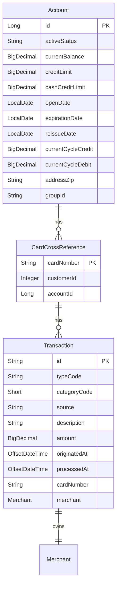

# Online Transaction Management — domain model

**Review the Java in this pull request.** The diagram and notes make that faster.

*Could a Java developer who has never seen the legacy system read and maintain this?*

> `CONFORMANCE.md` — 10 type corrections applied, nothing blocking.

## Model

## Entities

- **`Account`** → `accounts` — A customer credit-card account with balance, credit limits, and cycle-to-date totals
- **`CardCrossReference`** → `card_cross_references` — Links a card number to its owning account and customer, enabling card-to-account lookup
- **`Transaction`** → `transactions` — A financial transaction (payment, purchase, etc.) against a card, with merchant details and timestamps

## Left out of the model

| Source record | Why |
|---|---|
| `COCOM01Y` | CICS COMMAREA - transient screen/program state transfer structure, not persisted business data |
| `COTTL01Y` | Screen title constants - UI presentation text, not persisted business data |
| `CSDAT01Y` | Working-storage date/time scratch area (WS- prefix) - runtime formatting fields, not persisted business data |
| `CSMSG01Y` | Common message text constants - UI error/info messages, not persisted business data |
| `COCOM01Y.CDEMO-USRTYP-*` | UserType enum (ADMIN/USER) belongs to authentication/session context, not to this feature's persistent domain. Noted for the authentication feature. |
| `COCOM01Y.CDEMO-PGM-*` | ProgramContext enum (ENTER/REENTER) is CICS screen-flow control, not a business concept. |
| `CCDA-SCREEN-TITLE.CCDA-THANK-YOU` | Dead field - never referenced outside copybook |
| `CSDAT01Y.WS-CURTIME-MILSEC` | Dead field - never referenced outside copybook |
| `CSDAT01Y.WS-CURTIME-N` | Dead field - never referenced outside copybook |
| `CSDAT01Y.WS-TIMESTAMP-TM-HH` | Dead field - never referenced outside copybook |
| `CSDAT01Y.WS-TIMESTAMP-TM-MM` | Dead field - never referenced outside copybook |
| `CSDAT01Y.WS-TIMESTAMP-TM-SS` | Dead field - never referenced outside copybook |

## Open questions

- Transaction ID generation: the legacy system increments the last transaction ID (character field). Need to decide whether to use a database sequence, a service-layer approach that reads MAX(id) and increments, or retain the legacy string-increment logic. A sequence is safest for concurrency but changes the ID format.
- TRAN-TYPE-CD '02' and TRAN-CAT-CD 2 are hardcoded for bill payment. Are there other type/category codes in the broader system that should be modelled as enums? The legacy code for this feature only reveals '02'/2. Deferring enum creation until the full set of codes is known avoids an incomplete enum that blocks other features.
- ACCT-ACTIVE-STATUS: the acceptance criteria check 'account is not active' but do not specify the exact character values. Is 'Y' = active the only valid value, or are there other statuses (e.g. 'C' for closed, 'S' for suspended)? Need the full value set before creating an enum.
- The 'curr' prefix group on Account (currentBalance, currentCycleCredit, currentCycleDebit) was deliberately NOT extracted into an embeddable. currentBalance is a fundamentally different concept (point-in-time balance) from the cycle accumulators. Reviewer should confirm this decision.
- Merchant embeddable fields are marked nullable because online bill payments (the primary flow in this feature) set source='POS TERM' but may not have a real merchant. The add-transaction flow does accept merchant fields. Confirm that merchant fields are indeed optional for payment transactions.
- XREF-CUST-ID references a customer record that is outside this feature's scope. Modelled as a bare Long foreign key column. The Customer entity will be defined by whichever feature owns customer management.
- Column sizes (e.g. varchar(50) for merchant_name, varchar(100) for description) are reasonable defaults from typical COBOL PIC X lengths but the exact PIC sizes for TRAN-DESC, TRAN-MERCHANT-NAME, TRAN-MERCHANT-CITY, TRAN-SOURCE were not provided in the deterministic facts. These should be verified against the actual copybook PIC clauses.
- The acceptance criteria say balance is 'reduced to zero' on bill payment. This implies the payment amount equals the full current balance (no partial payments). Should the domain model or service layer enforce this constraint, or is partial payment a future requirement?