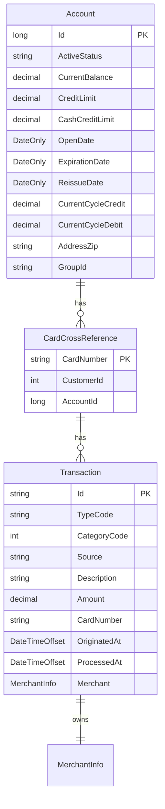

# Online Transaction Management — domain model

**Review the C# in this pull request.** The diagram and notes make that faster.

*Could a C# developer who has never seen the legacy system read and maintain this?*

> `CONFORMANCE.md` — 11 type corrections applied, nothing blocking.

## Model

## Entities

- **`Account`** → `accounts` — A customer credit-card account with its balance, credit limits, and billing-cycle accumulators
- **`CardCrossReference`** → `card_cross_references` — Links a payment card number to its owning account and customer
- **`Transaction`** → `transactions` — A single financial transaction (payment, purchase, etc.) against a card

## Left out of the model

| Source record | Why |
|---|---|
| `COCOM01Y` | CICS COMMAREA — transient inter-program communication state, not persisted business data |
| `COTTL01Y` | Screen title / UI constants — presentation layer, not persisted |
| `CSDAT01Y` | Working-storage date/time scratch area — runtime formatting helpers, not persisted |
| `CSMSG01Y` | Common UI message constants — presentation layer, not persisted |
| `COCOM01Y.CDEMO-USRTYP-*` | User type enum (Admin/User) belongs to authentication/session context, not to this feature's persisted domain. Noted for the authentication feature. |
| `COCOM01Y.CDEMO-PGM-*` | Program re-entry context enum — CICS navigation state, not persisted |
| `CCDA-SCREEN-TITLE.CCDA-THANK-YOU` | Dead field — never referenced outside copybook |
| `WS-DATE-TIME.WS-CURTIME-MILSEC` | Dead field — never referenced outside copybook |
| `WS-DATE-TIME.WS-CURTIME-N` | Dead field — never referenced outside copybook |
| `WS-DATE-TIME.WS-TIMESTAMP-TM-HH` | Dead field — never referenced outside copybook |
| `WS-DATE-TIME.WS-TIMESTAMP-TM-MM` | Dead field — never referenced outside copybook |
| `WS-DATE-TIME.WS-TIMESTAMP-TM-SS` | Dead field — never referenced outside copybook |

## Open questions

- ACCT-ACTIVE-STATUS: The acceptance criteria check for 'active' status but the full set of valid values is not enumerated in the legacy code provided. Should we define an enum (e.g. Active/Inactive/Closed) or keep it as a constrained string until the full value set is confirmed?
- TRAN-TYPE-CD: Only '02' (bill payment) is visible in the acceptance criteria. The complete set of type codes is needed to define a proper enum. Until then it is modelled as varchar(2).
- TRAN-CAT-CD: Only category 2 is visible. Same situation as type code — needs the full value set before an enum is warranted.
- TRAN-ID generation: The legacy system increments the last transaction ID (string-based sequential). In PostgreSQL this could be a SEQUENCE, a hi-lo strategy, or application-level logic. The concurrency and uniqueness guarantees need to be decided — a database sequence is safest but changes the format from the legacy zero-padded string.
- TRAN-MERCHANT-ID: Modelled as bigint based on typical COBOL PIC 9 patterns, but the exact PICTURE clause for this field was not provided. If it is alphanumeric (PIC X), it should be varchar instead.
- ACCT-CURR-BAL sign and precision: Modelled as numeric(13,2) to accommodate signed balances (the criteria reference zero and negative balances). The exact PICTURE (e.g. S9(11)V99) was not provided — confirm precision is sufficient.
- XREF-CUST-ID references a Customer entity that is outside the scope of this feature. The FK constraint to a customers table should be added when that feature is modelled.
- Account.AddressZip and Account.GroupId field lengths: Exact PIC clauses were not provided in the deterministic facts. Lengths of varchar(10) are reasonable defaults but should be confirmed.
- The acceptance criteria mention balance adjustment logic that differs by transaction type (credits vs debits updating different cycle totals). The full rules for which type codes are credits vs debits need to be documented to implement the domain service correctly.